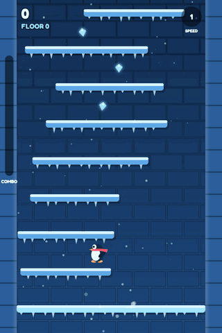
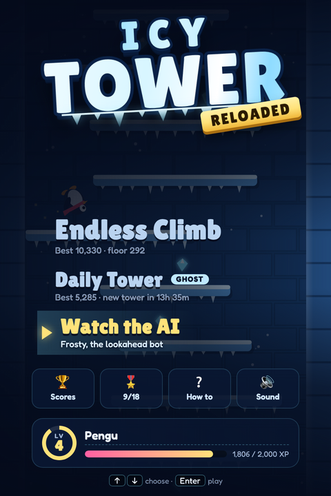
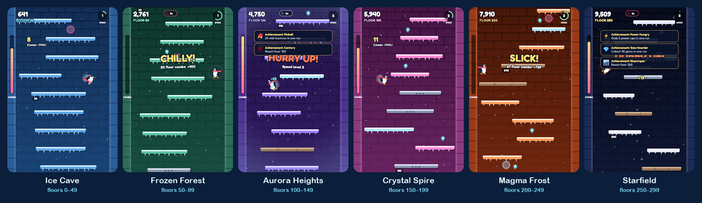
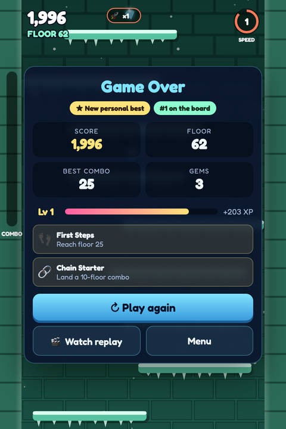
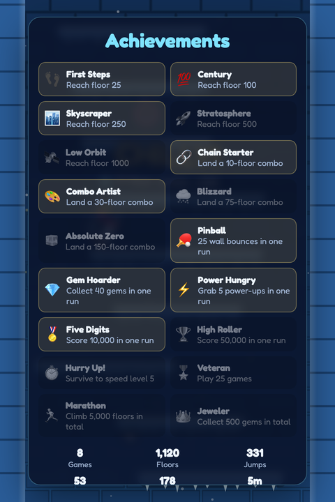
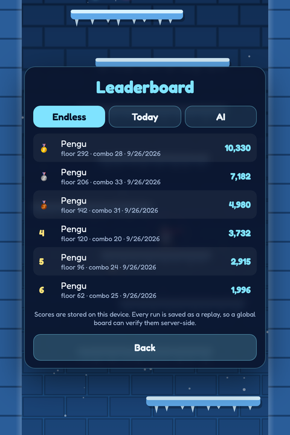
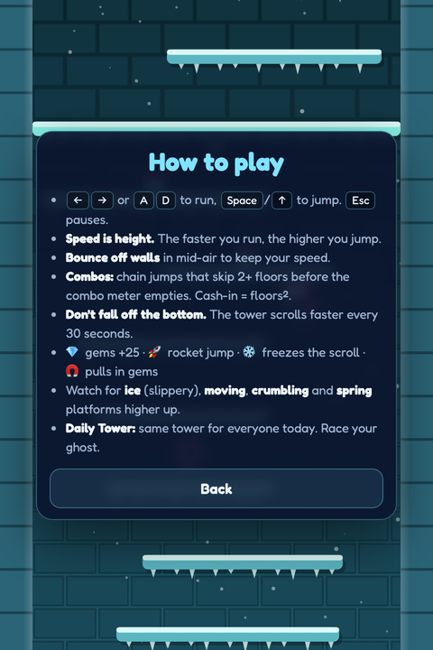
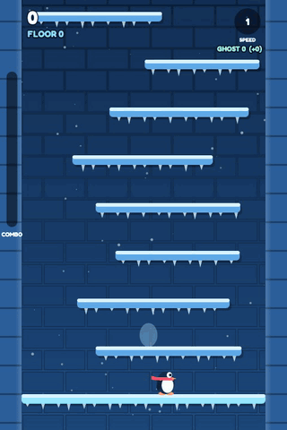
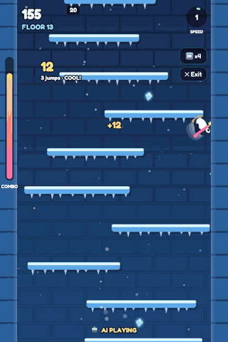

<div align="center">

# 🐧 Icy Tower Reloaded

**A browser remake of the classic Icy Tower, with more to unlock, a daily challenge, replays and an AI that plays it.**

Run fast, jump high, chain combos and don't fall off the bottom.


<br />


&nbsp;&nbsp;


</div>

---

## Quick start

```bash
npm install
npm run dev
```

Then open **http://localhost:5173** and press <kbd>Enter</kbd>.

| Command | What it does |
| --- | --- |
| `npm run dev` | Start the game with hot reload |
| `npm run build` | Type-check and build a static bundle into `dist/` |
| `npm test` | Engine determinism and replay verification tests |
| `npm run bot` | Headless AI benchmark (`npm run bot -- <games> <seed>`) |

## How to play

| | Keyboard | Touch |
| --- | --- | --- |
| Run | <kbd>←</kbd> <kbd>→</kbd> or <kbd>A</kbd> <kbd>D</kbd> | ◀ ▶ pads |
| Jump | <kbd>Space</kbd> or <kbd>↑</kbd> | ▲ pad |
| Pause | <kbd>Esc</kbd> or <kbd>P</kbd> | |

- **Speed is height.** The faster you run, the higher you jump.
- **Bounce off walls** in mid-air to keep your speed.
- **Combos:** chain jumps that skip 2+ floors before the meter runs out. A combo cashes in for floors².
- **Keep moving.** The tower starts scrolling at floor 5 and speeds up every 30 seconds.

## Features

### A new zone every 50 floors

Six themed zones, each with its own palette, cross-faded as you climb. Higher zones add ice, moving, crumbling and spring platforms.

<p align="center">
  
</p>

### Progression

<table>
  <tr>
    <td align="center" width="25%"><br /><sub><b>Run summary</b>: XP, badges, unlocks</sub></td>
    <td align="center" width="25%"><br /><sub><b>18 achievements</b> that pop mid-run</sub></td>
    <td align="center" width="25%"><br /><sub><b>Leaderboards</b>: Endless, Today, AI</sub></td>
    <td align="center" width="25%"><br /><sub><b>How to play</b>, built in</sub></td>
  </tr>
</table>

- **XP and player levels**, plus lifetime stats (games, floors, jumps, combos, gems, play time).
- **Personal-best marker** drawn on the tower wall, so you know when you're past it.
- **Pickups:** 💎 gems (+25), 🚀 rocket jump, ❄️ freeze the scroll, 🧲 gem magnet.
- **Juice:** particles, screen shake, combo ratings from "NICE" all the way to "ABSOLUTE ZERO", and synthesized sound with no audio files.
- **Touch controls** on phones and tablets.

### Daily Tower: race your ghost



Everyone gets the same seeded tower each day, and it resets at midnight UTC.

Your best run becomes a **ghost** that you race on every retry. The HUD shows how many floors you're ahead or behind (`GHOST 9 (-2)`).

Every run is also recorded as a **replay**. You can watch it back from the game-over screen.

<br clear="right" />

### Watch the AI



**Frosty** is a lookahead planner. Every few ticks it clones the game, simulates 90 short action plans, and picks the one that ends up highest and safest. It needs no training, because the engine is deterministic and cheap to clone.

Watch it from the menu at ×1, ×4 or ×16 speed. It also plays the attract-mode demo behind the title screen. Headless, it regularly gets past floor 2,000:

```text
$ npm run bot -- 4 7
seed 7: floor 2090, score 69921, best combo 36 floors, 492s game time in 7.3s, replay 15136B verified
seed 8: floor 2574, score 84276, best combo 29 floors, 600s game time in 8.5s, replay 18419B verified
```

<br clear="right" />

## Architecture

The game state is a pure function of `(seed, inputs)`. A whole run is stored as `{ seed, inputs }` in a few KB, and it can be re-simulated anywhere to verify the score.

```
src/engine/   Pure, deterministic simulation: no DOM, no Date, no Math.random
  sim.ts      createGame(seed) / step(state, inputBits) / cloneGame
  replay.ts   Input recorder (RLE), simulateReplay() for verification, Ghost
  rng.ts      Seeded RNG and daily seed
src/agents/   Agent interface (observe → input bits) + PlannerAgent ("Frosty")
src/render/   Canvas renderer, zone themes, particles (driven by engine events)
src/meta/     Profile, XP, achievements, leaderboards (localStorage)
src/main.ts   Game loop (fixed 60 Hz + interpolation), menus, pilots (human / AI / replay)
scripts/      Headless bot benchmark
tests/        Determinism, cloning, replay round-trip
```

### Write your own agent

An agent sees an `Observation` each tick and returns an input bitmask. The engine doesn't touch the DOM, so an agent runs in Node at thousands of ticks per second:

```ts
import type { Agent } from './src/agents/api';
import { INPUT_JUMP, INPUT_RIGHT } from './src/engine/constants';

export const bunnyHop: Agent = {
  name: 'Bunny hop',
  act: (obs) => (obs.player.grounded ? INPUT_RIGHT | INPUT_JUMP : INPUT_RIGHT),
};
```

See [`scripts/bot.ts`](scripts/bot.ts) for a headless benchmark loop. In the browser, `window.icyTower` exposes `state`, `observe()` and `lastReplay()` for console tinkering.

## Roadmap

1. **Global leaderboard.** The client submits a replay, the server runs `simulateReplay()` and stores the verified score, so a score can't be faked over the network.
2. **AI agent arena.** An HTTP/WebSocket API around `observe()`/`step()` lets outside agents (LLMs, Python RL bots) play headless, with their own leaderboard.
3. **Shareable ghosts.** A link that carries a replay, so friends can race each other's runs.
4. **Weekly seasons, cosmetic unlocks** (scarves and hats bought with gems), and **async multiplayer races** on the same seed.

<div align="center">
<sub>All screenshots and GIFs are real gameplay, recorded headlessly from the dev build with Frosty at the controls.</sub>
</div>
